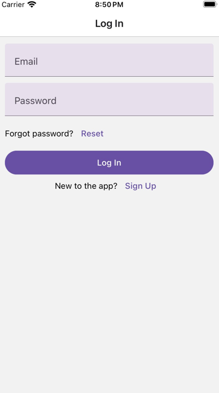
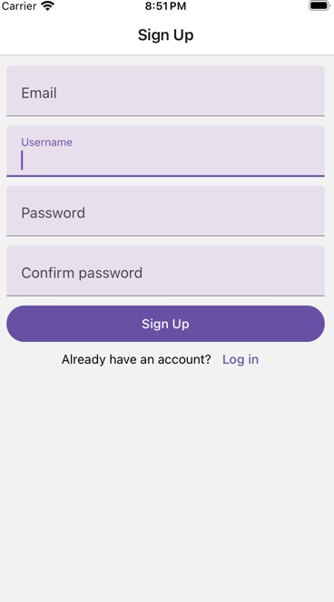
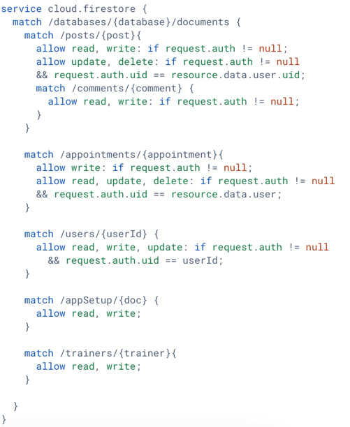
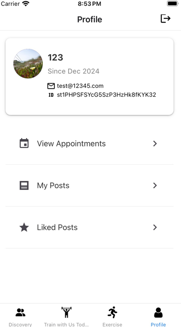
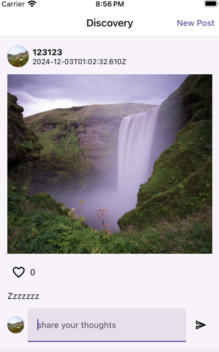
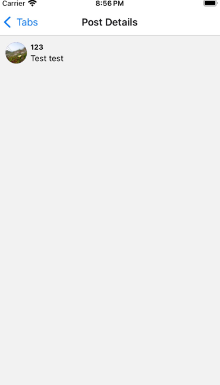

**CS5520 Final Project Iteration 3** 
Team members: Zhiyu Wu, Han Nie 
Data Model: 
4 collections: appointments, posts, trainers, users 
**Appointment fields**: userId, trainerId, trainerName, datetime 
CRUD operations: create an appointment, read user's appointments, delete appointments 
**Post Fields**: text, timestamp, likedBy, imageUri, user (uid, username, imageUri) 
CRUD operations: create a post, update post, delete post, read user's posts or read all posts 
**Trainer fields**: trainerId, name, focus, bookedTimeslots, availability, imageUri, latitude, longitude 
CRUD operations: read trainer information 
**User fields**: username, createdAt, imageUri  
CRUD operations: create user, read current user information 

1 sub-collection: post/comments  
**Comment fields**: text, user (uid, username, imageUri)
CRUD operations: create a comment, read all comments

**Contributions** 
Zhiyu: 
Zhiyu implemented the code for "Video" screen (accessed via exercise screen). For Video screen, Zhiyu added codes to make user able to navigate to video lists with specific category (fetched via Youtube API) via clicking on the category card on the exercise screen. Also, Zhiyu implemented the search function that when user typed in specific keyword, the screen with video lists that contain videos related to specific keywords will be shown. Also, when user clicked on the video of the video list, user would navigate to the video player screen where via webview user can indeed watch the video.  

Han: 
1. Implemented authentication by adding the Auth screen, using the React Context API for state management,
and building functionalities including user login, signup, password reset and logout.  
 
 
 
2. Added authorization rules in firebase to achieve fine-grained access control. 
 
3. Added a users collection in firestore to store additional information about the user,
including username, profile image URI and account creation time,
and displayed the information in user's profile. 
 
4. Implemented post editing and deleting features. 
 
5. Implemented the post comment feature and added the PostDetails screen, where all comments to the post are displayed. 
 

