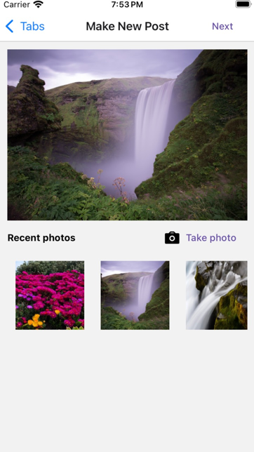
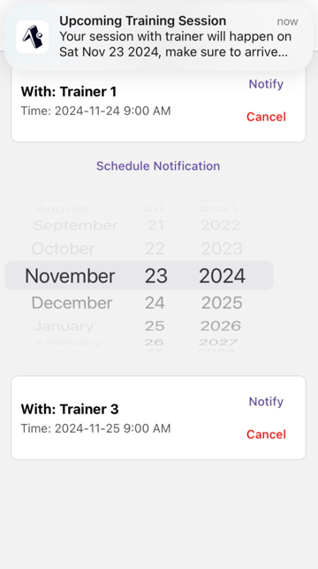

**CS5520 Final Project Iteration 2** 
Team members: Zhiyu Wu, Han Nie 
Data Model: 
3 collections: Appointments, Posts, Trainer 
**Appointments Fields**: userId, trainerId, trainerName, datetime 
CRUD operations: Create an appointment, Read user's appiontments, delete (cancel) appointments 
**Posts Fields**: userId, text, timestamp, likedBy, imageUri 
CRUD operations: Create a post, Read user's posts or Read all posts 
**Trainer Fields**: trainerId, name, focus, bookedTimeslots, availability, imageUri, latitude, longitude 
CRUD operations: read trainer's information 

**Contributions** 
Zhiyu: 
Zhiyu implemented the code for "TrainerMap" screen (accessed via "Locate Nearby Trainers" in Appointment screen) . For TrainerMap screen, Zhiyu added markers for user location, and added markers for all trainers. The markers' size would dynamically adjust based on the zoom level. Also, the trainers would be clustered when the map is in a high zoom level. When user clicks on the markers (avatars) of the trainers, there would be a modal showing information of the trainer and button to make an appointment with the trainer. If the user clicks "Reserve", he/she would enter the same reserve screen they would enter if they clicks "Reserve" in appointment screen.  

Han: 
1. Implemented the ImageManager component to provide image using camera or selecting from media library.
  
2. Implemented the NotificationManager component to schedule local notifications.
  
3. Abstracted the code for authentication logic into authContext and a custom useAuth hook.

