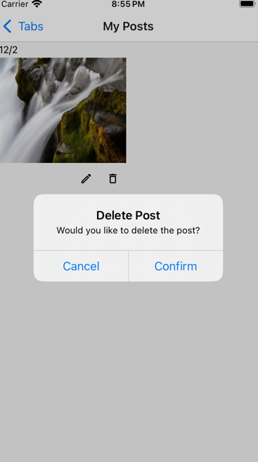

**CS5520 Final Project Iteration 3** 
Team members: Zhiyu Wu, Han Nie 
Data Model: 
4 collections: appointments, posts, trainers, users 
**Appointment fields**: userId, trainerId, trainerName, datetime 
CRUD operations: create an appointment, read user's appointments, delete appointments 
**Post Fields**: text, timestamp, likedBy, imageUri, user (uid, username, imageUri) 
CRUD operations: create a post, update post, delete post, read user's posts or read all posts 
**Trainer fields**: trainerId, name, focus, bookedTimeslots, availability, imageUri, latitude, longitude 
CRUD operations: read trainer information 
**User fields**: username, createdAt, imageUri  
CRUD operations: create user, read current user information 

1 sub-collection: post/comments  
**Comment fields**: text, user (uid, username, imageUri)
CRUD operations: create a comment, read all comments

**Contributions** 
Zhiyu: 
Zhiyu implemented the code for "TrainerMap" screen (accessed via "Locate Nearby Trainers" in Appointment screen) . For TrainerMap screen, Zhiyu added markers for user location, and added markers for all trainers. The markers' size would dynamically adjust based on the zoom level. Also, the trainers would be clustered when the map is in a high zoom level. When user clicks on the markers (avatars) of the trainers, there would be a modal showing information of the trainer and button to make an appointment with the trainer. If the user clicks "Reserve", he/she would enter the same reserve screen they would enter if they clicks "Reserve" in appointment screen.  

Han: 
1. Implemented authentication by adding the Auth screen, using the React Context API for state management,
and building functionalities including user login, signup, password reset and logout.  
 
 
 
2. Added authorization rules in firebase to achieve fine-grained access control. 
 
3. Added a users collection in firestore to store additional information about the user,
including username, profile image URI and account creation time,
and displayed the information in user's profile. 
 
4. Implemented post editing and deleting features. 
 
5. Implemented the post comment feature and added the PostDetails screen, where all comments to the post are displayed. 
 

