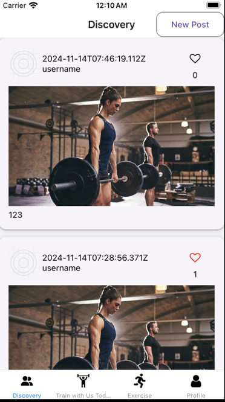
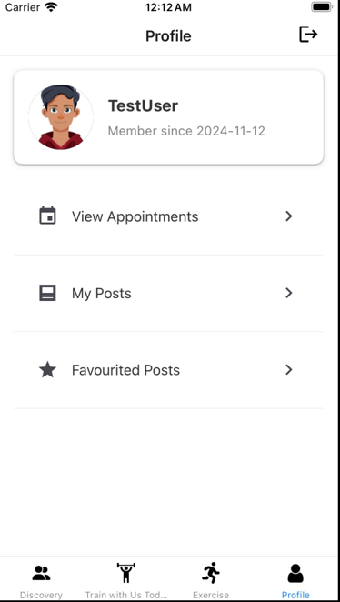
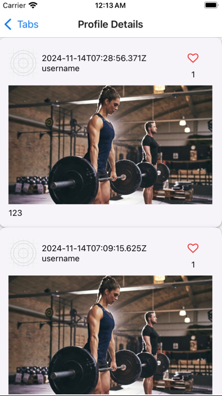

**CS5520 Final Project** 
Team members: Zhiyu Wu, Han Nie 
Data Model: 
3 collections: Appointments, Posts, Trainer 
**Appointments Fields**: userId, trainerId, trainerName, datetime 
CRUD operations: Create an appointment, Read user's appiontments, delete (cancel) appointments 
**Posts Fields**: userId, text, timestamp, likedBy, imageUri 
CRUD operations: Create a post, Read user's posts or Read all posts 
**Trainer Fields**: trainerId, name, focus, bookedTimeslots, availability, imageUri 
CRUD operations: read trainer's information 

**Contributions** 
Zhiyu: 
Zhiyu implemented the code for Appointment screen and Exercises screen. For Appointment screen, Zhiyu added cards for all trainers, showing their information and providing a "reserve" button. When the button is clicked, user would be directed to the Reserve screen developed by Zhiyu. In the Reserve screen, user can picked the available timeslots for the specific trainer in the calendar and made the appointment. Also, Zhiyu implemented filters in the Appointment screen.  

For exercises screen, Zhiyu implemented search bar (not functioning yet) for user to search specific videos. User can also clicked on specific cards for different categories (video not inserted yet) to browse the videos under the specific categories.  

Zhiyu also designed the UI for profile screen, and implemented the "View my appointments" screen for user to check their appointments. user can also cancel their appointments within the "View my appointments" screen. 

Han:  
1. Built Auth screen and implemented user authentication functionalities including signup, login, and logout.

2. set up the firebase configuration and helper functions to perform CRUD operations on fireBase.
3. created the Discovery screen and New Post screen and implemented functionalities such as like/unlike and post making.

4. Implemented the Profile Details Screen, which is used commonly by the three options to conditionally render corresponding data.

